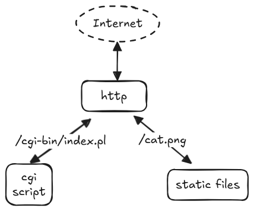
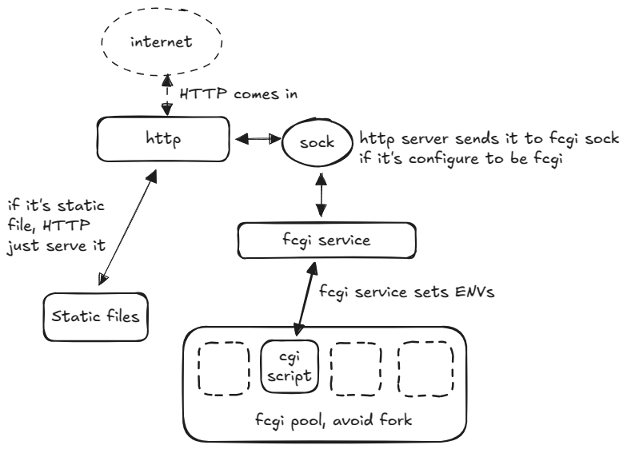

CGI (Common gateway interface) used to be the most popular way to write dynamic web applications back in the 90s.

it's still probably the simplest way to get something up and running on the internet. To write a GCI app, all you need is a http server and some scripts written in any language you like.

The gist of it is ...





history: NCSA


introduce perl...


cgi had some serious performance issue...


introduce fast_cgi...





cgi is still the simplest way to get something up and running on the web...

- automatic resource management (process exit after respond)
- language agnostic (any language will work)
- simple stack (only need to serve /cgi-bin)

- Typical web servers of this time had 1-2 CPUs and 1-4 GB of memory.


### A CGI webhook

```bash
#!/bin/sh

echo Content-type: text/plain
echo

echo CGI/1.0 test script report:
echo

echo argc is $#. argv is "$*".
echo

echo SERVER_SOFTWARE = $SERVER_SOFTWARE
echo SERVER_NAME = $SERVER_NAME
echo GATEWAY_INTERFACE = $GATEWAY_INTERFACE
echo SERVER_PROTOCOL = $SERVER_PROTOCOL
echo SERVER_PORT = $SERVER_PORT
echo REQUEST_METHOD = $REQUEST_METHOD
echo HTTP_ACCEPT = "$HTTP_ACCEPT"
echo PATH_INFO = $PATH_INFO
echo PATH_TRANSLATED = $PATH_TRANSLATED
echo SCRIPT_NAME = $SCRIPT_NAME
echo QUERY_STRING = $QUERY_STRING
echo REMOTE_HOST = $REMOTE_HOST
echo REMOTE_ADDR = $REMOTE_ADDR
echo REMOTE_USER = $REMOTE_USER
echo CONTENT_TYPE = $CONTENT_TYPE
echo CONTENT_LENGTH = $CONTENT_LENGTH
```


Example, listen on a webhook and perform some tasks ...


Folder structure

```
.
├── flake.nix
├── cgi.nix
├── app
│   └── cgi-bin
│       ├─── hook
│       │    └─── note.pl
│       └─── hash.cl
...
```


### /app/cgi-bin/hook/note.pl


```perl
#!/usr/bin/env perl

use strict;
use warnings;
use Digest::SHA qw(hmac_sha256_hex);

warn scalar(localtime) . " - hook called\n";

my $dir      = "/srv/note";
my $repo_url = "https://github.com/ailrk/note.git";
my $secret   = $ENV{'GITHUB_NOTE_WEBHOOK_SECRET'};


# Verify the caller.
my $body;
read(STDIN, $body, $ENV{'CONTENT_LENGTH'});


my $computed  = "sha256=" . hmac_sha256_hex($body, $secret);
my $signature = $ENV{'HTTP_X_HUB_SIGNATURE_256'} || '';


unless ($computed eq $signature) {
    print "Status: 403 Forbidden\n";
    print "Content-Type: text/plain\n\n";
    print "Invalid signature\n";
    exit;
}


unless (-d $dir) {
    # Create parent directory if needed
    my $parent = $dir;
    $parent =~ s{[^/]+$}{};
    mkdir $parent unless -d $parent;
    my $clone_output = `gh repo clone $repo_url $dir 2>&1`;
    my $clone_status = $? >> 8;
    die "Failed to clone repo: $clone_output" if $clone_status != 0;
}


chdir $dir or die "Can't cd to dir $dir: $!";


my $output = `gh repo sync 2>&1`;
my $status = $? >> 8;


print "Content-Type: text/plain\n\n";
if ($status == 0) {
    print "Repo synced successfully\n";
} else {
    print "Repo sync failed\n$output\n";
}
```


```lisp
#!/usr/bin/env sbcl --script

;; Simple Common Lisp CGI script to return current Git hash

(defun repo-hash (dir)
  "Return the latest git hash of DIR, or NIL if not a git repo."
  (let ((git-dir (merge-pathnames ".git/" (pathname dir))))
    (if (probe-file git-dir)
        (let* ((cmd (format nil "git --git-dir=~A rev-parse HEAD" git-dir))
               (output (with-output-to-string (s)
                         (uiop:run-program cmd :output s
                            :error-output :string :ignore-error-status t))))
          (string-trim '(#\Newline #\Space) output))
        nil)))

;; CGI response
(format t "Content-Type: text/plain~%~%")

(let ((dir "/srv/note"))
  (let ((hash (repo-hash dir)))
    (if hash
        (format t "Current Git hash: ~A~%" hash)
        (format t "Directory ~A is not a git repository.~%" dir))))
```

To run this script, the http server needs to ...


Lots of http logic that we do in application code are now the responsibility of the http server...


The complete setup in nix...


### /cgi.nix

```nix
{ config, pkgs, ... }:
{
  services.fcgiwrap.instances.app = {
    process = { user = "nginx"; group = "nginx"; };
    socket = { user = "nginx"; group = "nginx"; };
    socket.mode = "0660";
    socket.address = "/run/fcgiwrap-app.socket";
  };

  systemd.services."fcgiwrap-app" = {
    # Make sure it starts after nginx user is created.
    # Otherwise nixos will just give it a random UID.
    after = [ "network.target" ];
    # Need to give fcgi server access to perl
    serviceConfig = {
      Environment = "PATH=${pkgs.perl}/bin";
      EnvironmentFile = config.sops.templates."fcgi-envs".path;
    };
  };

  services.nginx = {
    virtualHosts."app.example.com" = {
      forceSSL = true;
      enableACME = true;
      root = "/var/run/app";
      extraConfig = ''
        limit_req_zone $binary_remote_addr zone=cgi_limit:10m rate=5r/s;
      '';
      locations."/cgi-bin" = {
        extraConfig = ''
          fastcgi_pass  unix:/run/fcgiwrap-app.socket;
          fastcgi_param REQUEST_METHOD  $request_method;
          fastcgi_param SCRIPT_FILENAME $document_root$fastcgi_script_name;
          fastcgi_param REQUEST_METHOD  $request_method;
          fastcgi_param QUERY_STRING    $query_string;
          fastcgi_param CONTENT_TYPE    $content_type;
          fastcgi_param CONTENT_LENGTH  $content_length;
          limit_req zone=cgi_limit burst=10 nodelay;
          limit_req_status 429;
        '';
      };
    };
  };

  systemd.services.copy-app-cgi = {
    description = "Generate Authelia secret files if missing";
    wantedBy = [ "multi-user.target" ];
    serviceConfig = {
      Type = "oneshot";
      ExecStart = pkgs.writeShellScript "copy-app-cgi" ''
        rm -rf /var/run/app && mkdir -p /var/run/app
        cp -r ${app}/* /var/run/app
        chown -R nginx:nginx /var/run/app
      '';
      RemainAfterExit = false;
    };
  };
}
```

Paul Graham & viaweb, Continutation


Security: (eval, escape string, etc)


|                   |          |                                                                              |
|-------------------|----------|------------------------------------------------------------------------------|
| **CGI**           | **1993** | Standardized for early web servers (NCSA httpd, later Apache).               |
| **PHP/FI**        | **1995** | Started as CGI scripts in C. Later evolved into the PHP for Apache.          |
| **FastCGI**       | **1996** | Developed to avoid fork-per-request. Persistent processes+socket.            |
| **Java Servlet**  | **1997** | Java equivalent to CGI developed by SUN, multithreaded.                      |
| **WSGI**          | **2003** | Analogous to CGI but Python-only and persistent.                             |
| **Rack**          | **2007** | Heavily inspired by WSGI. Became the basis for Rails, Sinatra, etc.          |
| **WAI**           | **2009** | Haskell equivalent to WSGI/Rack.                                             |


|              |                           |                                    |                                               |
| ------------ | ------------------------- | ---------------------------------- | --------------------------------------------- |
| 1993–2000    | CGI                       |                                    | Fork per request, simple, language-agnostic   |
| 1997–2005    | FastCGI / WSGI / Servlets |                                    | Persistent processes, abstract gateway        |
| 2005–2015    | Hidden inside framework   | Rails, Django, Spring MVC, ASP.NET | Framework handles HTTP, routing, session      |
| 2009–2018    | Node.js native            | Express                            | Event-driven, async, no traditional gateway   |
| 2015–present | Embedded HTTP server      | Spring Boot, Go net/http, Actix    | Language-specific HTTP servers, microservices |


future:


Key points:
CGI is fun
CGI is still the easiet way to write web application
CGI is language agnostic
The concept of a Gateway is becoming more and more blury, today it's completed merged into backend frameworks today.
reason:
    - language specific implementations gives best performance
    -
result:
web framework becomes more and more opaque, people no longer touch the HTTP stack first hand.


## Reference
- [Cgi Programming 101: Perl for the World Wide Web,  Jacqueline D. Hamilton](https://www.cgi101.com/book/)
- [CGI Programming on the world wide web, Shishir Gundavaram](https://www.oreilly.com/openbook/cgi/)
- [ngx_http_fastcgi_module](https://nginx.org/en/docs/http/ngx_http_fastcgi_module.html)
- [fcgiwrap](https://github.com/gnosek/fcgiwrap)
- [Lisp in Web-Based Applications, Paul Graham](https://sep.turbifycdn.com/ty/cdn/paulgraham/bbnexcerpts.txt?t=1688221954&)
- [The Common Gateway Interface, ncsa](https://www6.uniovi.es/~antonio/ncsa_httpd/cgi/)
- [The WWW Common Gateway Interface Version 1.1](https://datatracker.ietf.org/doc/html/draft-coar-cgi-v11-00)
- [Writing secure CGI scripts](https://www6.uniovi.es/~antonio/ncsa_httpd/cgi/security.html)
- [Serving 200 million requests per day with a cgi-bin](https://jacob.gold/posts/serving-200-million-requests-with-cgi-bin/)
- [Serving a half billion requests per day with Rust + CGI](https://jacob.gold/posts/serving-half-billion-requests-with-rust-cgi/)
- [FormMail.pl](https://www.scriptarchive.com/download.cgi?s=formmail&c=txt&f=FormMail%2Epl)
- [FormMail](https://www.scriptarchive.com/formmail.html)
- [Practical Programming in Tcl and Tk, Brent Welch](http://www.beedub.com/book/2nd/guestbk.doc.html#19072)
