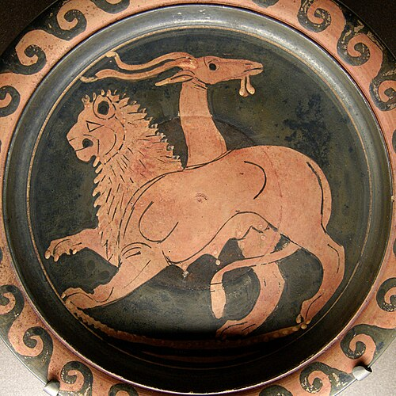

</img>

Chimerica is a term used to describe the sinbiotic relationship between Chinese and the US economy. Historian Niall Ferguson coined the term in late 2006. He claimed that the saving by the Chinese and the overspending by Americans led to an incredible period of wealth creation that contributed to the 2008 financial crisis. China accumulates surplus over years, and put them into US government securities. This allows the US to print more US dollars, because it will always be backed by the national securities which is backed by Chinese surplus. The US dollars turn into investment, a lot of them goes to China, faciliate more Chinese industries.

The period of Chinese economy reformation was roughly the same time as the Reagonomics, the US switched to neo-liberalism, companies are looking for ways to reduce the cost of manufacturing. This two events hoked up perfectly in time, the US industry was then slowly transferred to China, which led to the rust belt. Meanwhile the US was able to print more dollars to enable its financial industry, the extra cash energized the investment market, which faciliates more economic growth.

The accumulation of American debt has been esitmated at over `$800 billion`. The number is absolutely bebemoth. It shows the two nations are intrinsically linked. Anything happen to each side will cause damage to the other. If China support buying the US securities, US government can no longer print dollars. If the US stop out sourcing the manufacturing, China will no longer has the surplus. If the two nations are decoupled too fast, both economics will be heavily damanged.

Chimerica is not only a economical phenomenon, a lot of high-up Chinese officials have their assets in the US to escape the government supervisions, their kids mostly study in US, some of them live in US. Menawhile, the US companies have large scale investment projects in China, a lot of assets are owned by the US companies. Chinese also own a lot of US land, which is another way money to circulate back to the US. The economic links tricle down to every level of the society.

Hence, economically speakig, China and US are not two countries, but one. The name Chimerica is used to describe this phenomenon.
