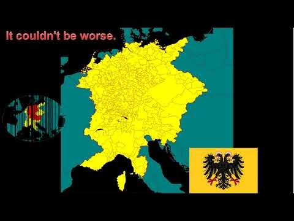

</img>

The Holy Roman Empire, founded in 962 with Otto I's imperial coronation, was a loose and enduring politcal order in centrual Europe that combined the legacy of the Roman Empire with German kinship and Christian authority.

Rather than a centralized state, it functioned as a complex mosaic of kingdoms, duchies, bishoprics, and free cities, with power constantly negotiated between emperors, princes, and papacy, most famously during the Investiture Controversy.

Overtime, imperial authority weakend as territorial rulers gained automony, a trend reinforced by the Reformation, the Thirty Years' War, and the Peace of Westphalia (1648), which confirmed the empire's decentralized structure.

By 18th century it has become largely symbolic, and it was dissolved in 1806 when Emperor Francis II abdicated under the pressure of Napoleon.
