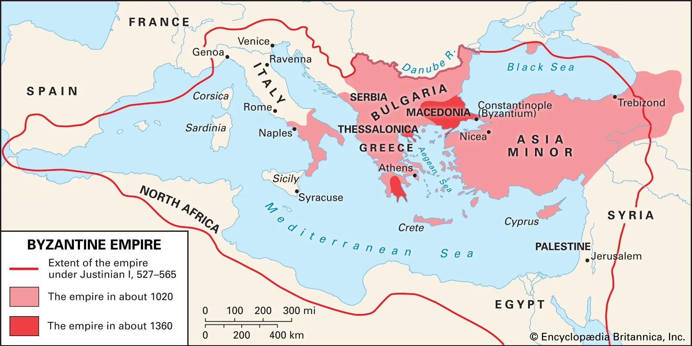

</img>

The Byzantine empire was essentially the Medieval Roman Empire, serving as a bridge between antiquity and the modern world for over a thousand years. While Western Roman fell in 476 AD, the East thrived, preserving Greek culture and Roman Law.

In 330 AD, Constantine the Great moved the captial of Roman Empire to Byzantium, renaming it Constantinople. Its location was strategic, sitting at the crossroads of Europe and Asia. Unlike the West, the East was wealthier, more urbanized, and easier to defend.

</img>

The empire reached its peak under Justinian I (482 AD - 565 AD). His reign was defeind by three massive achievements: the reconquest, the law, and the culture.

On reconquest, he retook North Africa, Italy, and parts of Spain, this effort partially recovered much of the old Roman territory. On law, he codified Roman law into the Corpuss Juris Civilos, which was first applied throughout the Eastern Mediterannean, and is still the basis of civil law many modern legal systems. On culture, his reign marked a blossoming of Byzantine culture. He built the Hagia Sophia, and engineering marvel that remained the world largest cathedral for nearly a millennium.

Byzantium faced centuries of relentless pressure and change from 7th century to 11th century. The empire lost Egypt, Syria, and Palestine to Arab conquest during the rise of Islam; Latin was replaced by Greek as the offical language under the reign of Heraclius; And in 1054 it faced the Great Schism: The permanent split between the Eastern Orthodox Church and the Roman Catholic Church (The Flilioque Dispute).

The inevitable decline of the Byzantine empire began after the Battle of Manzikert (1071), where the Seljuk Turks criplled the Byzantine army. Later, Byzantine faced the greatest betray in history: The fourth Crusade (1024). Instead of fighting for Jerusalem, western crusaders sacked Constantinople, looting the city and shattering Byzantine power. Through the Greeks eventually retook the city in 1261, the empire was never the same again.

By the 15th century, the empire had shrunk to little more than the city of Constantinople itself. In 1453, the Ottoman Sultan Mehmed the Conqueror used massive cannons to breach the city's legendary walls. The last emperor, Constatine XI, died in the fighting, marking the end of the Roman line.

Byzantium acted as a shield for Europe against eastern invasions and preserved the classical knnowledge of Greece and Rome, which eventually fueled the Renaisssance in Italy.
